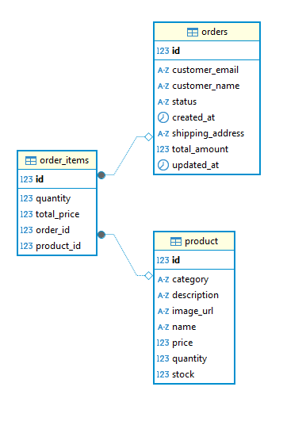

# webshop-backend

## How to Run the Backend Locally for Testing:

1 - Install Docker: https://docs.docker.com/desktop/setup/install/windows-install/

2 - Run the Backend with Docker Compose:

    docker-compose up -d

## URLS

### Product Management (/api/products)

- Create Product: POST http://localhost:8080/api/products
- Get All Products: GET http://localhost:8080/api/products
- Get Product by ID (e.g., with ID 1): GET http://localhost:8080/api/products/1
- Get Product by name: GET http://localhost:8080/api/products/search/{name}
- Get Product by category: GET http://localhost:8080/api/products/category/{category}
- Update Product by ID (e.g., with ID 1): PUT http://localhost:8080/api/products/1
- Delete Product by ID (e.g., with ID 1): DELETE http://localhost:8080/api/products/1

### Payment Management (/api/payments)

- Process Payment: POST http://localhost:8080/api/payments/process

### Order Management (/api/orders)

- Create Order: POST http://localhost:8080/api/orders
- Get All Orders: GET http://localhost:8080/api/orders
- Get Order by {orderId} (e.g., with ID 1): GET http://localhost:8080/api/orders/1
- Update Order Status by {orderId} (e.g., with ID 1): PUT http://localhost:8080/api/orders/1/status
- Cancel Order by {orderId} (e.g., with ID 1): PUT http://localhost:8080/api/orders/1/cancel

### I Management (/api/inventory)

- Update Stock by {productId} (e.g., with ID 1): PUT http://localhost:8080/api/inventory/1/stock?stock=10

## Database

